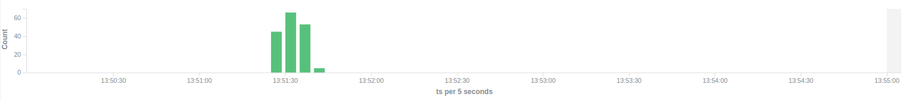

# SJ Ping Station Demo


There is a diagram that demonstrates the processing workflow of demo
that is responsible for collecting of aggregated information on accessibility of nodes.
Green, yellow and purple blocks are executed with SJ-Platform
and it is ps-input module, ps-process module and ps-output module, respectively.
As you can see, the data come in input module through pipeline of fping and netcat.
Then the input module parses ICMP echo responses (select IP and response time)
and ICMP unreachable responses (select only IP)
and puts parsed data into 'echo-response' stream and 'unreachable-response' stream, respectively.
After that the process module aggregates response time and total amount of echo/unreachable responses by IP by 1 minute
and sends aggregated data to 'echo-response-1m' stream.
Finally the output module just displace aggregated data from 'echo-response-1m' to Elasticsearch.  
Also you can launch more than one ps-process modules and ps-output modules, respectively (ref. Customization)

## Table of contents

- [Installation](#installation)
- [Preparation](#preparation)
- [Launching](#launching)
    * [Customization](#customization)
- [Shutdown](#shutdown)
- [See the Results](#see-the-results)

## Installation

You should follow these steps to build and upload the all of modules of ping station demo:

```bash
$ git clone https://github.com/bwsw/sj-fping-demo.git
$ cd sj-fping-demo
$ sbt assembly
$ address=<host>:<port>
$ curl --form jar=@ps-input/target/scala-2.11/ps-input-1.0.jar http://$address/v1/modules
$ curl --form jar=@ps-process/target/scala-2.11/ps-process-1.0.jar http://$address/v1/modules
$ curl --form jar=@ps-output/target/scala-2.11/ps-output-1.0.jar http://$address/v1/modules
```

## Preparation

After loading the modules you should create streams that will be used in the instances of input, process and output modules by sending several post requests:

- To create an output stream of input module (consequently, an input stream of process module) that will be used for keeping an IP and average time from ICMP echo response and also timestamp of the event
```bash
$ curl --request POST "http://$address/v1/streams" -H 'Content-Type: application/json' --data "@api-json/streams/echo-response.json"
```
- To create another output stream of input module (consequently, an input stream of process module) that will be used for keeping an IP from ICMP unreachable response and also timestamp of the event
```bash
$ curl --request POST "http://$address/v1/streams" -H 'Content-Type: application/json' --data "@api-json/streams/unreachable-response.json"
```
- To create an output stream of process module (consequently, an input stream of output module) that will be used for keeping an aggregated information for each IP (by minute)
about average time of echo response, total amount of echo responses, total amount of unreachable responses and the timestamp
```bash
$ curl --request POST "http://$address/v1/streams" -H 'Content-Type: application/json' --data "@api-json/streams/echo-response-1m.json"
```
- To create an output stream of output module that will be used for keeping an aggregated information (by minute) from previous stream including total amount of responses
```bash
$ curl --request POST "http://$address/v1/streams" -H 'Content-Type: application/json' --data "@api-json/streams/es-echo-response-1m.json"
```

Then you should create an instance for each module:

- For creating an instance of input module send the following post request:
```bash
$ curl --request POST "http://$address/v1/modules/input-streaming/pingstation-input/1.0/instance" -H 'Content-Type: application/json' --data "@api-json/instances/pingstation-input.json"
```
- For creating an instance of process module send the following post request:
```bash
$ curl --request POST "http://$address/v1/modules/regular-streaming/pingstation-process/1.0/instance" -H 'Content-Type: application/json' --data "@api-json/instances/pingstation-process.json"
```
- For creating an instance of output module send the following post request:
```bash
$ curl --request POST "http://$address/v1/modules/output-streaming/pingstation-output/1.0/instance" -H 'Content-Type: application/json' --data "@api-json/instances/pingstation-output.json"
```

## Launching

After that you can launch the every module:

- For launching the input module send:
```bash
$ curl --request GET "http://$address/v1/modules/input-streaming/pingstation-input/1.0/instance/pingstation-input/start"
```
- For launching the process module send:
```bash
$ curl --request GET "http://$address/v1/modules/regular-streaming/pingstation-process/1.0/instance/pingstation-process/start"
```
- For launching the output module send:
```bash
$ curl --request GET "http://$address/v1/modules/output-streaming/pingstation-output/1.0/instance/pingstation-output/start"
```

To get a list of listening ports of input module:
```bash
$ curl --request GET "http://$address/v1/modules/input-streaming/pingstation-input/1.0/instance/pingstation-input"
```
and look at field named tasks, e.g. it will look like
> "tasks": {   
> &nbsp;&nbsp;"pingstation-input-task0": {   
> &nbsp;&nbsp;&nbsp;&nbsp;"host": "176.120.25.19",  
> &nbsp;&nbsp;&nbsp;&nbsp;"port": 31000   
> &nbsp;&nbsp;},   
> &nbsp;&nbsp;"pingstation-input-task1": {   
> &nbsp;&nbsp;&nbsp;&nbsp;"host": "176.120.25.19",   
> &nbsp;&nbsp;&nbsp;&nbsp;"port": 31004   
> &nbsp;&nbsp;}   
> &nbsp;}   

And now you can start a flow:
```bash
fping -l -g 91.221.60.0/23 2>&1 | nc 176.120.25.19 31000
```

### Customization

If you want to change an aggregation interval you can follow these steps:

- Create two additional streams like 'echo-response-1m' and 'es-echo-response-1m'
(e.g. ['echo-response-3m'](api-json/streams/echo-response-3m.json) and
['es-echo-response-3m'](api-json/streams/es-echo-response-3m.json))
- Create an instance (with different name) of process module only changing the 'checkpoint-interval' at the corresponding time (in milliseconds)
- Create an instance (with different name) of output module only changing the 'input' at 'echo-response-3m' and the 'output' at 'es-echo-response-3m'

After that, you can launch this two instances as described above in the launching section
(don't forget to change the instance name: 'pingstation-process' and 'pingstation-output' in the request line
```bash
$ curl --request GET "http://$address/v1/modules/regular-streaming/pingstation-process/1.0/instance/<new instance name>/start"
```
```bash
$ curl --request GET "http://$address/v1/modules/output-streaming/pingstation-output/1.0/instance/<new instance name>/start"
```
).

## Shutdown

To stop the modules:

- For stopping the input module send:
```bash
$ curl --request GET "http://$address/v1/modules/input-streaming/pingstation-input/1.0/instance/pingstation-input/stop"
```
- For stopping the process module send:
```bash
$ curl --request GET "http://$address/v1/modules/regular-streaming/pingstation-process/1.0/instance/pingstation-process/stop"
```
- For stopping the output module send:
```bash
$ curl --request GET "http://$address/v1/modules/output-streaming/pingstation-output/1.0/instance/pingstation-output/start"
```

## See the Results

To see the results of processing containing in ElasticSearch go to the [Kibana](http://176.120.25.19/).

Firstly, click the Settings tab and fill in the data entry field '\*' instead of 'logstash-*'.
Then there will appear the another data entry field called 'Time-field name', you should choose 'ts'
from the combobox and press the create button.
After that, click the Discover tab. Finally, you can choose a time interval called 'Last 15 minutes' in the top right corner of the page,
as well as an auto-refresh interval of 45 seconds. Now you should see something like this:


